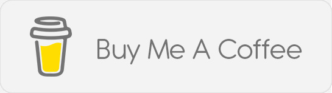

<picture>

</picture>

<picture>

</picture>

> /rɒnɪ/

I'm a Web Developer and Linux Enthusiast.  
Come talk to me about coffee, chess, guitar, custom keyboards, weightlifting, and coding!  
Love listening to neo soul, r&b, and soft pop music for the chill vibe.  

I've been using Arch Linux as my daily driver since 2019, loved to mess around my setups and customizing my workspaces.  
Here are my desktop setups that I've been using for quite some time.  
[suckless](https://www.github.com/ronylee11/suckless) - my very first build with dwm + picom, dwmblocks for statusbar, dunst for notifications, slock for lockscreen, st+tabbed for minimal resource terminal  
[xfce+bspwm](https://www.github.com/ronylee11/xfce-bspwm) - my second build, utilizing the rich features of DE by combining it with a tiling window manager, made on my old laptop when I had to send my main laptop to repair  
[awesome](https://www.github.com/ronylee11/awesome) - my latest build of a very awesome setup with awesomeWM  

My current favourite editor is nvim (btw). 
Here is my IDE setup  
[ant](https://www.github.com/ronylee11/ant) - I use Alacritty terminal, Neovim as my editor, and Tmux to organize my terminal sessions.  

Visit my [personal website](https://rony.is-a.dev)

If you liked my work and wanted to support me, you can buy me a coffee!  
Your support will boost my motivation to keep creating more awesome stuff!  

🧰 Languages and tools I'm learning until now:  

<picture>
<source media="(prefers-color-scheme: light)" srcset="https://img.shields.io/static/v1?label=&message=HTML5&color=%23E34F26&style=for-the-badge&logo=html5&logoColor=whitesmoke"></source>
<source media="(prefers-color-scheme: dark)" srcset="https://img.shields.io/static/v1?label=&message=HTML5&color=%23E34F26&style=for-the-badge&logo=html5&logoColor=whitesmoke"></source>

</picture>
<picture>
<source media="(prefers-color-scheme: light)" srcset="https://img.shields.io/static/v1?label=&message=CSS3&color=%231572B6&style=for-the-badge&logo=css3&logoColor=whitesmoke"></source>
<source media="(prefers-color-scheme: dark)" srcset="https://img.shields.io/static/v1?label=&message=CSS3&color=%231572B6&style=for-the-badge&logo=css3&logoColor=whitesmoke"></source>

</picture>
<picture>
<source media="(prefers-color-scheme: light)" srcset="https://img.shields.io/static/v1?label=&message=Javascript&color=%23F7DF1E&style=for-the-badge&logo=javascript&logoColor=grey"></source>
<source media="(prefers-color-scheme: dark)" srcset="https://img.shields.io/static/v1?label=&message=Javascript&color=%23F7DF1E&style=for-the-badge&logo=javascript&logoColor=grey"></source>

</picture> 
 
<picture>
<source media="(prefers-color-scheme: light)" srcset="https://img.shields.io/badge/php-%23777BB4.svg?style=for-the-badge&logo=php&logoColor=white"></source>
<source media="(prefers-color-scheme: dark)" srcset="https://img.shields.io/badge/php-%23777BB4.svg?style=for-the-badge&logo=php&logoColor=white"></source>

</picture>
<picture>
<source media="(prefers-color-scheme: light)" srcset="https://img.shields.io/badge/laravel-%23FF2D20.svg?style=for-the-badge&logo=laravel&logoColor=white"></source>
<source media="(prefers-color-scheme: dark)" srcset="https://img.shields.io/badge/laravel-%23FF2D20.svg?style=for-the-badge&logo=laravel&logoColor=white"></source>

</picture>
<picture>
<source media="(prefers-color-scheme: light)" srcset="https://img.shields.io/badge/mysql-%2300f.svg?style=for-the-badge&logo=mysql&logoColor=white"></source>
<source media="(prefers-color-scheme: dark)" srcset="https://img.shields.io/badge/mysql-%2300f.svg?style=for-the-badge&logo=mysql&logoColor=white"></source>

</picture>
 
<picture>
<source media="(prefers-color-scheme: light)" srcset="https://img.shields.io/static/v1?label=&message=BOOTSTRAP&color=blueviolet&style=for-the-badge&logo=bootstrap&logoColor=whitesmoke"></source>
<source media="(prefers-color-scheme: dark)" srcset="https://img.shields.io/static/v1?label=&message=BOOTSTRAP&color=blueviolet&style=for-the-badge&logo=bootstrap&logoColor=whitesmoke"></source>

</picture>
<picture>
<source media="(prefers-color-scheme: light)" srcset="https://img.shields.io/static/v1?label=&message=MONGODB&color=brightgreen&style=for-the-badge&logo=mongoDB&logoColor=whitesmoke"></source>
<source media="(prefers-color-scheme: dark)" srcset="https://img.shields.io/static/v1?label=&message=MONGODB&color=brightgreen&style=for-the-badge&logo=mongoDB&logoColor=whitesmoke"></source>

</picture>
<picture>
<source media="(prefers-color-scheme: light)" srcset="https://img.shields.io/static/v1?label=&message=EXPRESS&color=grey&style=for-the-badge&logo=express&logoColor=whitesmoke"></source>
<source media="(prefers-color-scheme: dark)" srcset="https://img.shields.io/static/v1?label=&message=EXPRESS&color=grey&style=for-the-badge&logo=express&logoColor=whitesmoke"></source>

</picture>
<picture>
<source media="(prefers-color-scheme: light)" srcset="https://img.shields.io/static/v1?label=&message=NODE.JS&color=green&style=for-the-badge&logo=node.js&logoColor=whitesmoke"></source>
<source media="(prefers-color-scheme: dark)" srcset="https://img.shields.io/static/v1?label=&message=NODE.JS&color=green&style=for-the-badge&logo=node.js&logoColor=whitesmoke"></source>

</picture>
 
<picture>
<source media="(prefers-color-scheme: light)" srcset="https://img.shields.io/static/v1?label=&message=GIT&color=%23F05032&style=for-the-badge&logo=git&logoColor=whitesmoke"></source>
<source media="(prefers-color-scheme: dark)" srcset="https://img.shields.io/static/v1?label=&message=GIT&color=%23F05032&style=for-the-badge&logo=git&logoColor=whitesmoke"></source>

</picture>
<picture>
<source media="(prefers-color-scheme: light)" srcset="https://img.shields.io/static/v1?label=&message=GITHUB&color=%23181717&style=for-the-badge&logo=github&logoColor=whitesmoke"></source>
<source media="(prefers-color-scheme: dark)" srcset="https://img.shields.io/static/v1?label=&message=GITHUB&color=%23181717&style=for-the-badge&logo=github&logoColor=whitesmoke"></source>

</picture>
 
<picture>
<source media="(prefers-color-scheme: light)" srcset="https://img.shields.io/badge/c++-%2300599C.svg?style=for-the-badge&logo=c%2B%2B&logoColor=white"></source>
<source media="(prefers-color-scheme: dark)" srcset="https://img.shields.io/badge/c++-%2300599C.svg?style=for-the-badge&logo=c%2B%2B&logoColor=white"></source>

</picture>
<picture>
<source media="(prefers-color-scheme: light)" srcset="https://img.shields.io/badge/java-%23ED8B00.svg?style=for-the-badge&logo=openjdk&logoColor=white"></source>
<source media="(prefers-color-scheme: dark)" srcset="https://img.shields.io/badge/java-%23ED8B00.svg?style=for-the-badge&logo=openjdk&logoColor=white"></source>

</picture>
<picture>
<source media="(prefers-color-scheme: light)" srcset="https://img.shields.io/badge/python-3670A0?style=for-the-badge&logo=python&logoColor=ffdd54"></source>
<source media="(prefers-color-scheme: dark)" srcset="https://img.shields.io/badge/python-3670A0?style=for-the-badge&logo=python&logoColor=ffdd54"></source>

</picture>
<picture>
<source media="(prefers-color-scheme: light)" srcset="https://img.shields.io/badge/lua-%232C2D72.svg?style=for-the-badge&logo=lua&logoColor=white"></source>
<source media="(prefers-color-scheme: dark)" srcset="https://img.shields.io/badge/lua-%232C2D72.svg?style=for-the-badge&logo=lua&logoColor=white"></source>

</picture>
 
<picture>
<source media="(prefers-color-scheme: light)" srcset="https://img.shields.io/static/v1?label=&message=REACT.JS&color=%2361DAFB&style=for-the-badge&logo=react&logoColor=grey"></source>
<source media="(prefers-color-scheme: dark)" srcset="https://img.shields.io/static/v1?label=&message=REACT.JS&color=%2361DAFB&style=for-the-badge&logo=react&logoColor=grey"></source>

</picture>
<picture>
<source media="(prefers-color-scheme: light)" srcset="https://img.shields.io/static/v1?label=&message=SASS&color=%23CC6699&style=for-the-badge&logo=sass&logoColor=whitesmoke"></source>
<source media="(prefers-color-scheme: dark)" srcset="https://img.shields.io/static/v1?label=&message=SASS&color=%23CC6699&style=for-the-badge&logo=sass&logoColor=whitesmoke"></source>

</picture>
<picture>
<source media="(prefers-color-scheme: light)" srcset="https://img.shields.io/static/v1?label=&message=Typescript&color=%233178C6&style=for-the-badge&logo=typescript&logoColor=03256C"></source>
<source media="(prefers-color-scheme: dark)" srcset="https://img.shields.io/static/v1?label=&message=Typescript&color=%233178C6&style=for-the-badge&logo=typescript&logoColor=03256C"></source>

</picture>
 
<picture>
<source media="(prefers-color-scheme: light)" srcset="https://img.shields.io/static/v1?label=&message=NEXT.JS&color=%23000000&style=for-the-badge&logo=next.js&logoColor=white"></source>
<source media="(prefers-color-scheme: dark)" srcset="https://img.shields.io/static/v1?label=&message=NEXT.JS&color=%23000000&style=for-the-badge&logo=next.js&logoColor=white"></source>

</picture>
<picture>
<source media="(prefers-color-scheme: light)" srcset="https://img.shields.io/static/v1?label=&message=NEST.JS&color=%23E0234E&style=for-the-badge&logo=nestjs&logoColor=white"></source>
<source media="(prefers-color-scheme: dark)" srcset="https://img.shields.io/static/v1?label=&message=NEST.JS&color=%23E0234E&style=for-the-badge&logo=nestjs&logoColor=white"></source>

</picture>
<picture>
<source media="(prefers-color-scheme: light)" srcset="https://img.shields.io/static/v1?label=&message=REDIS&color=%23DC382D&style=for-the-badge&logo=redis&logoColor=whitesmoke"></source>
<source media="(prefers-color-scheme: dark)" srcset="https://img.shields.io/static/v1?label=&message=REDIS&color=%23DC382D&style=for-the-badge&logo=redis&logoColor=whitesmoke"></source>

</picture>
<picture>
<source media="(prefers-color-scheme: light)" srcset="https://img.shields.io/static/v1?label=&message=POSTGRESQL&color=%23336791&style=for-the-badge&logo=postgresql&logoColor=whitesmoke"></source>
<source media="(prefers-color-scheme: dark)" srcset="https://img.shields.io/static/v1?label=&message=POSTGRESQL&color=%23336791&style=for-the-badge&logo=postgresql&logoColor=whitesmoke"></source>

</picture>

📖 What I'm learning next:  

<picture>
<source media="(prefers-color-scheme: light)" srcset="https://img.shields.io/static/v1?label=&message=RUST&color=%23E57324&style=for-the-badge&logo=rust&logoColor=whitesmoke"></source>
<source media="(prefers-color-scheme: dark)" srcset="https://img.shields.io/static/v1?label=&message=RUST&color=%23E57324&style=for-the-badge&logo=rust&logoColor=whitesmoke"></source>

</picture>
<picture>
<source media="(prefers-color-scheme: light)" srcset="https://img.shields.io/static/v1?label=&message=ZIG&color=%23EC1DFF&style=for-the-badge&logo=zig&logoColor=whitesmoke"></source>
<source media="(prefers-color-scheme: dark)" srcset="https://img.shields.io/static/v1?label=&message=ZIG&color=%23EC1DFF&style=for-the-badge&logo=zig&logoColor=whitesmoke"></source>

</picture>

📱 How to reach me:  

